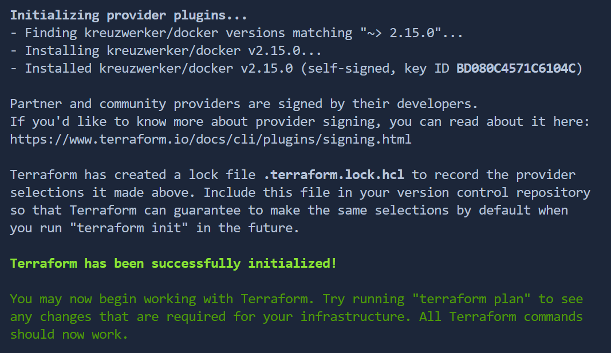
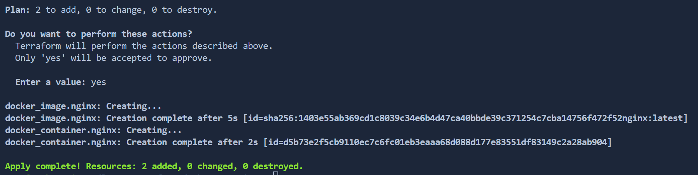
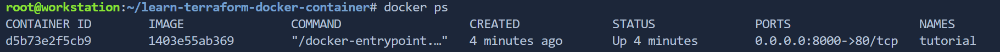

# Getting Started with Terraform

Terraform is one of the most popular open-source infrastructure as code (IAC) tools. It allows you to define an infrastructure for variou on-prem and cloud providers (e.g. AWS, Azure, Google Cloud, DigitalOcean, etc.) using a simple, declarative programming language. It also helps you to deploy and manage that infrastructure using a few CLI commands.

In this tutorial you will learn how to set a work environment and use it to define and manage your infrastructure from scratch.

## Prerequisites

To complete this tutorial successfully, you will need Terraform and Docker installed. Please visit the URLs below and install compatible versions for your system if necessary.
- [Terraform](https://www.terraform.io/downloads.html) 
- [Docker](https://docs.docker.com/engine/install/)

## Getting started

After installing Terraform, you're ready to start and create your first infrastructure. 

The basic unit of a Terraform project is a folder containing Terraform script files. A Terraform project is any directory that contains *.tf files. The code below will create a work folder and change your Terminal working directory to a new one. 

```shell
$ mkdir terraform-demo
$ cd terraform-demo
```

## Create and populate configuration file

In Terraform, we use main.tf configuration file to store resources definition we need to provision. The following code will create main.tf file.

```shell
$ touch main.tf
```

When you have created the file, copy and paste the following code into the main.tf file and save your progress. 


```hcl
terraform {
  required_providers {
    docker = {
      source = "kreuzwerker/docker"
    }
  }
}
provider "docker" {
    host = "unix:///var/run/docker.sock"
}
resource "docker_container" "nginx" {
  image = docker_image.nginx.latest
  name  = "training"
  ports {
    internal = 80
    external = 80
  }
}
resource "docker_image" "nginx" {
  name = "nginx:latest"
}
```

**Note**: Terraform uses providers to create and manage your resources. In the example above, we have used `kreuzwerker/docker` provider for Docker. You can find other providers in [Terraform Registry](https://registry.terraform.io/browse/providers).

## Initialize project 

To download a plugin for Terraform to interact with Docker, you need to initialize the project by running the `init` command in your Terminal.


```shell
$ terraform init
```

Watch the output for any errors in the output:



The success message above confirms that Terraform completed the initialization, and it is time to move to the next task.

## Provision infrastructure

After successful initialization, you are good to provision the NGINX server container using the `apply` command:

```shell
$ terraform apply
```

The command will take up to a few minutes to run. However, before the actual run, you will find an overview of the actions it has planned to perform and detailed information about the docker image you are about to create.

Review the details, type 'yes' to confirm your choice, and hit 'Enter' to provision resources. 



If the infrastructure has been provisioned correctly, you will find running container details:

```shell
docker ps
```


## Destroy infrastructure

As a part of this tutorial, you will learn to destroy infrastructure. It is rarely performed on production resources but will help destroy stale infrastructures. In this tutorial, we show the process as a clean-up step.

```shell
$ terraform destroy
```

Remember to confirm your choice. To do so, type `yes` and hit ENTER. Terraform will destroy the resources you have created earlier in this exercise.

**Note**: Responses are case-sensitive, and Terraform will cancel the resource destruction if your answer is not all lower-case. 

## Next steps

You have now learned how to provision, review and destroy your infrastructure. 

Check our following tutorial to create variables and increase the flexibility and security of your configuration:[Define Input Variables](https://developer.hashicorp.com/terraform/tutorials/azure-get-started/azure-variables)